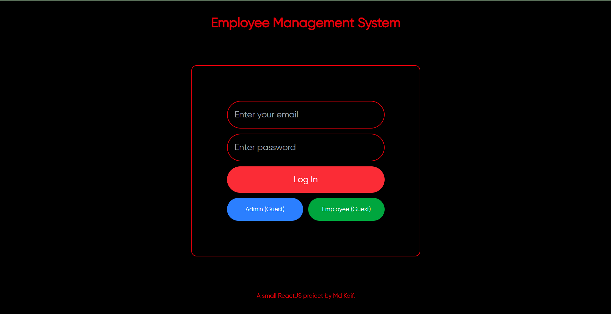

# Employee Management System (EMS)

## Overview

The **Employee Management System (EMS)** is a web application designed to manage tasks for employees and administrators. It features a login system, task management, and a dashboard for both admins and employees. Built with **React.js**, **Tailwind CSS**, and **Node.js**, this project demonstrates modern web development practices, including animations, responsive design, and state management.

---

## Features

### **Login Screen**
- Login as an **Admin** or an **Employee**.
  - **Admin Credentials**: 
    - Email: `admin@example.com`
    - Password: `123`
  - **Employee Credentials**:
    - Email: `bob@example.com`, `eve@example.com`, etc.
    - Password: `123`

### **Guest Login**
- **Quick Interaction**: Explore the app without logging in.
  - **Explore as Admin (Guest)**: Access the admin dashboard with sample data.
  - **Explore as Employee (Guest)**: Access the employee dashboard with sample data.

### **Admin Dashboard**
- **Add New Tasks**: Assign tasks to employees with properties like title, description, category, priority, and due date.
- **View Task Status**: Monitor the status of tasks for all employees (New, Active, Completed, Failed).

### **Employee Dashboard**
- **View Tasks**: Employees can see tasks assigned to them, categorized as:
  - New Tasks
  - Active Tasks
  - Completed Tasks
  - Failed Tasks

### **Animations**
- Fun and engaging animations, such as a **wiggling hand emoji** 👋🏼 in the header.

### **Responsive Design**
- Works well for larger screens, will work for different screen sizes.

---

## Technologies Used

- **Frontend**:
  - React.js
  - Tailwind CSS (for styling)
  - React Router (for navigation)
  - Context API (for state management)
- **Backend**:
  - Node.js (for server-side logic)
- **Other Tools**:
  - GitHub (for version control and deployment)
  - Vite (for fast development builds)

---

## Deployment

The application is deployed using **GitHub Pages**. You can access it here:
```
https://LordAizen1.github.io/ems
```

---

## Screenshots

### Login Screen


### Admin Dashboard


### Employee Dashboard


---

## How to Use

1. **Login**:
   - Use the provided credentials to log in as an admin or employee.

2. **Guest Login**:
   - Click **Explore as Admin (Guest)** to access the admin dashboard with sample data.
   - Click **Explore as Employee (Guest)** to access the employee dashboard with sample data.

3. **Admin Features**:
   - Add new tasks and assign them to employees.
   - View the status of all tasks across employees.

4. **Employee Features**:
   - View tasks assigned to you, categorized by status.
   - Mark tasks as completed or failed.

---

## Guest Login Functionality

The **Guest Login** feature allows users to explore the app without needing to log in. Here's how it works:

### **Explore as Admin (Guest)**
- Click the **Explore as Admin (Guest)** button on the login screen.
- You will be redirected to the **Admin Dashboard** with sample data.
- You can:
  - View all employees and their tasks.
  - Add new tasks (note: changes won't be saved for guests).

### **Explore as Employee (Guest)**
- Click the **Explore as Employee (Guest)** button on the login screen.
- You will be redirected to the **Employee Dashboard** with sample data.
- You can:
  - View tasks assigned to the guest employee.
  - Mark tasks as completed or failed (note: changes won't be saved for guests).

---

## Notes for Guests
- **Changes Won't Be Saved**: Any changes made while exploring as a guest (e.g., adding tasks, marking tasks as completed) will not be saved.

---

## Contact

For questions or feedback, feel free to reach out:
- **Name**: Md Kaif
- **Email**: mohdkaif2003@gmail.com
- **GitHub**: [LordAizen1](https://github.com/LordAizen1)

---

Enjoy exploring the **Employee Management System**! 🚀

---
